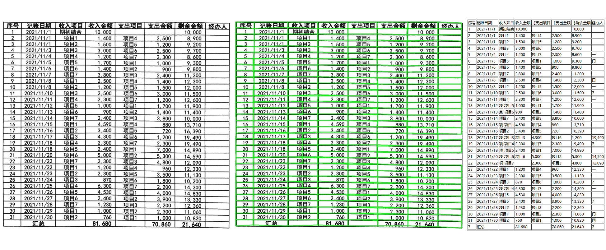

<div align="center">
  <div align="center">
    <h1><b>📊 Table Structure Recognition</b></h1>
  </div>
</div>

## Table of Contents
- [Introduction](##introduction)
- [Installation](##installation)
- [Usage](##usage)
- [Public Datasets](##datasets)
- [Future Work](##future-work)

## Introduction 

💖 This repository provides an inference toolkit for structured table recognition in documents. The table structure is recognized using a self-trained model. The related code is a secondary development based on [TableStructureRec](https://github.com/RapidAI/TableStructureRec/tree/main). 


[中文](README_CH.md)
## Installation
```python {linenos=table}
pip install -r requirements.txt
```

## Usage
We provide a simple script that can be used directly. With a single command, it outputs results in three formats: HTML, JSON, and intermediate visualizations.
```
python inference_batch.py --input_folder test_image
```

## Public Datasets
We have curated several public table training datasets, including **TAL_table**, **iflytab**, and **wtw**. We would like to thank the organizations for opening these datasets. In the future, we will also release our private dataset.

```
.
├── TAL_table
├── iflytab
├── wtw
└── train.json #
```

| Dataset               | Download      |
|----------------------|---------------|
| TAL_table & iflytab & wtw |         |
| our_dataset          | Coming Soon   |

## Future Work
- Integrate our latest self-developed dewarping and text rectification models  
- Improve model performance on complex borderless tables  
- Release training scripts and datasets
